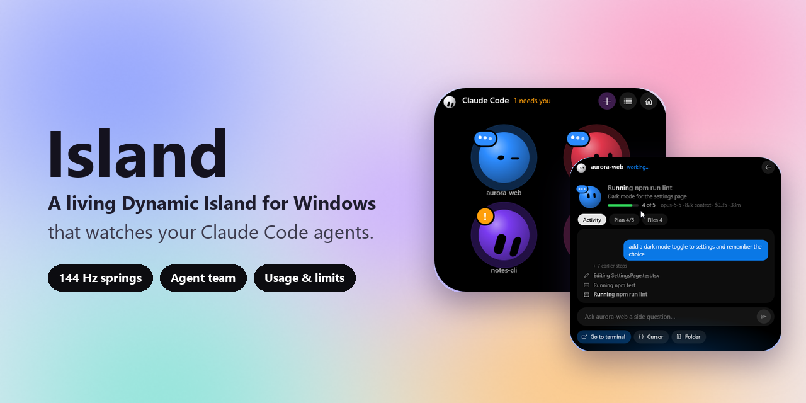
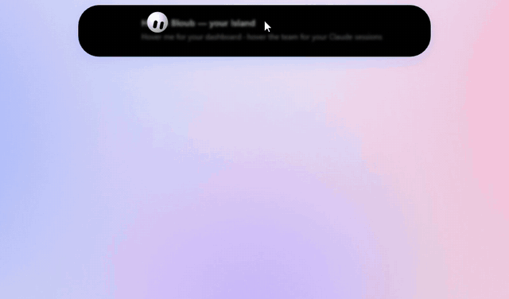
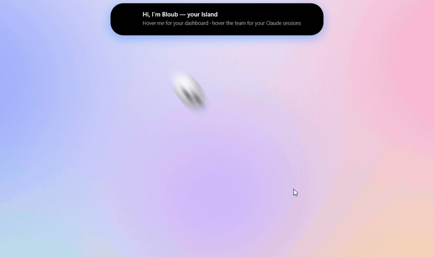
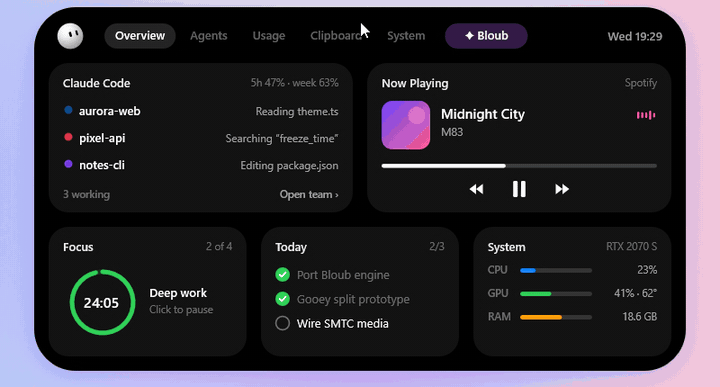
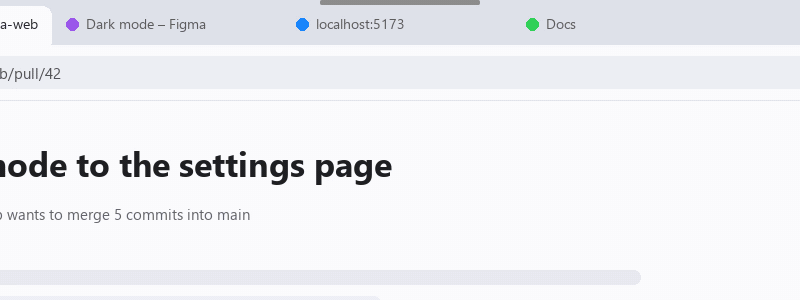
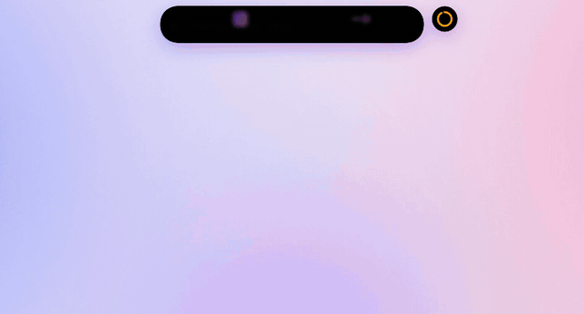
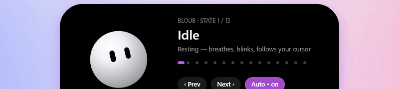
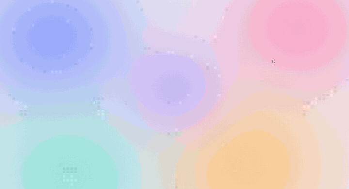
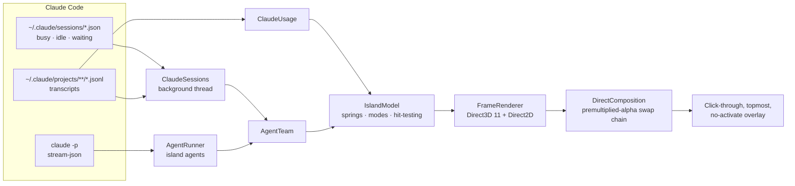

<div align="center">



# Island

**A living Dynamic Island for Windows that keeps an eye on your Claude Code agents.**

Native C# + Direct3D 11 + DirectComposition · 144 Hz spring physics · no Electron, no web view

[](https://github.com/UsoguiH/dynamic-island-windows/actions/workflows/build.yml)
[](https://github.com/UsoguiH/dynamic-island-windows/releases/latest)


[](LICENSE)
[](https://github.com/UsoguiH/dynamic-island-windows/stargazers)


<sub>Real captures of the app running. Nothing here is a mock-up in Figma.</sub>

</div>

---

Island sits at the top of your screen as a small black pill with a face. Its name is **Bloub**. It blinks, follows your cursor and stretches into whatever you need, using the same interruptible spring physics as the iPhone's Dynamic Island. Its main job is to watch **every Claude Code session you have running**, so you can stop alt-tabbing between terminals to check whether an agent is done or needs you.

> [!TIP]
> **No Claude Code? Try it anyway.** Run `IslandLab.exe --showcase` for a scripted team of agents, usage and limits. Nothing is read from your disk. Every GIF on this page was recorded in showcase mode.

## Contents

- [Features](#features)
- [Install](#install)
- [Hotkeys](#hotkeys)
- [How it works](#how-it-works)
- [Privacy](#privacy)
- [Roadmap](#roadmap)
- [Contributing](#contributing) · [Credits](#credits) · [License](#license)

## Features

### Your Claude Code agents as a team



Every running Claude Code session becomes a coloured Bloub in the pill. Hover to see the team, and click an agent to open it:

- **Live activity:** "Editing theme.ts → Running npm test", built from the session's transcript
- **Plan:** the agent's to-do list, with progress
- **Files:** every file it changed, and how many times
- **Needs you:** an orange badge and an alert when a session is waiting on you
- **Side questions:** ask a running session something without interrupting it (Island asks a read-only fork)
- **Go to terminal:** jumps straight to that session's window

**Zero config.** Island reads Claude Code's own session registry (`~/.claude/sessions`) and transcripts. It doesn't need hooks and doesn't touch your `settings.json`.

<br clear="right">

### Launch agents from the island

Press **+ New agent**, pick one of your recent projects, describe the task (or use a template) and choose a permission mode. The agent runs headless, and you answer **Allow / Deny** prompts and its questions right from the island. You can message it, stop it, restart it or continue it in a terminal (`claude --resume`) whenever you want.

### Bloub comes out when an agent is done



When a session finishes and you're looking elsewhere, Bloub **leaps out of the island**, lands next to your cursor and says it's done, with confetti in the agent's colour. Then it flies home and the island shows a banner.

It plays at most once every 12 s, and never during a fullscreen game.

<br clear="right">

### Usage, plan limits and a dashboard



- **Plan limits:** your real 5-hour and weekly usage rings with reset times, plus banners at 80% and 95%
- **Today:** tokens, active time, files edited and commands run, with hour, project, week and model breakdowns
- Everything is computed locally from `~/.claude/projects/**/*.jsonl`

### Never in your way



- **Auto-retract:** when a window's tabs sit under the island, it folds into a thin line. Hover the line to bring it back, or click it to open the dashboard.
- **Reserved bar** (optional): reserves a 40 px strip, so maximised windows start below the island
- **Click-through** everywhere except the black shape; it **never steals focus**
- **Hides in fullscreen games** automatically
- **One instance:** launching it again just opens the running island

### Motion that feels like Apple's



*Slow motion (Ctrl+Alt+0).* Every property has its own physical spring (analytic damped-spring solution, stable at any frame time), so animations can be **interrupted and retargeted mid-flight** without a jump. Content follows Apple's choreography: the old content blurs out first, the shape springs to its new size with the width leading, and the new content un-blurs into place. A second activity **buds off like a droplet**, using smooth-min signed distance fields. The island renders at your monitor's refresh rate (144 Hz here).

### Bloub: 15 states, 16 moods, 8 shapes



Bloub's engine is ported 1:1 from the original TypeScript to C#, with parity checked frame by frame (max error 7.6e-6). It covers blinking, gaze tracking, squash and stretch, and blending between any two states without a jump. Open the gallery with **Ctrl+Alt+9**.

### A proper entrance



<details>
<summary><b>Design previews: built, but still showing sample data</b></summary>

<br>

These screens are fully designed and animated. They show sample data until they're wired to Windows (see the [roadmap](#roadmap)):

- **Now Playing** with a live waveform, scrubber and controls (next up: Windows media controls / SMTC)
- **Focus timer** with rolling digits and a progress ring
- **Command bar** (Alt+Space style)
- **Clipboard**, **System** and **Today** tasks

</details>

## Install

### Download (recommended)

1. Grab **`IslandLab.exe`** from the [latest release](https://github.com/UsoguiH/dynamic-island-windows/releases/latest). It's a single self-contained file, so you don't need to install .NET.
2. Run it. Bloub drops out of the island to say hi.
3. Optional: right-click the tray icon → **Start with Windows**.

> [!NOTE]
> The exe isn't code-signed yet, so SmartScreen may warn you the first time: click **More info → Run anyway**. Or build it yourself in one command (below).

**Requirements:** Windows 10 (1903+) or 11, x64, any DirectX 11 GPU. [Claude Code](https://claude.com/claude-code) is optional; without it, use `--showcase`.

### Build from source

```powershell
git clone https://github.com/UsoguiH/dynamic-island-windows
cd dynamic-island-windows
dotnet run --project src/Island.Lab -c Release              # needs the .NET 10 SDK
dotnet run --project src/Island.Lab -c Release -- --showcase  # sample agents & usage
```

Single-file exe, the same as the release build:

```powershell
dotnet publish src/Island.Lab -c Release -p:PublishSingleFile=true -p:IncludeNativeLibrariesForSelfExtract=true -p:EnableCompressionInSingleFile=true -o publish
```

## Hotkeys

| Keys | Action |
|---|---|
| **Hover** the pill | Dashboard (centre) or agent team (the coloured Bloubs) |
| **Click** the pill | Open the dashboard · right-click collapses |
| `Ctrl+Alt+A` | Agent team |
| `Ctrl+Alt+D` | Preview the "done" celebration |
| `Ctrl+Alt+W` | Replay the intro |
| `Ctrl+Alt+H` | Toggle auto-retract (falls back to `R` or `J` if `H` is taken) |
| `Ctrl+Alt+B` | Toggle the reserved bar |
| `Ctrl+Alt+1` … `9` | Jump to a state: dormant, media, split, alert, expanded, dashboard, command bar, focus, Bloub gallery |
| `Ctrl+Alt+0` | Slow motion (0.2×) |
| `Ctrl+Alt+Q` | Quit |

**Options:** `--showcase` (or `ISLAND_SHOWCASE=1`) runs the scripted demo, and `ISLAND_RETRACT=0` starts with auto-retract off.

## How it works



| Layer | Choice | Why |
|---|---|---|
| Window | Raw Win32: `WS_EX_NOREDIRECTIONBITMAP`, topmost, no-activate | True per-pixel transparency; clicks pass through everything but the shape |
| Composition | DirectComposition + DXGI flip-model swap chain | Tear-free, vsync at the monitor's refresh rate |
| Rendering | Direct3D 11 + Direct2D/DirectWrite via [Vortice.Windows](https://github.com/amerkoleci/Vortice.Windows) | Every pixel is ours, so the motion is exactly what we design |
| Motion | Analytic damped springs (SwiftUI-style `response` / `dampingFraction`) | Interruptible and retargetable without losing velocity |
| Mascot | Bloub engine: radial body profile + eye cut-outs, pure functions of time | Deterministic, testable, blends any state into any other |

The full design doc covers the spring tokens, the choreography, the state sizes and the feature plan: **[docs/PLAN.md](docs/PLAN.md)**.

## Privacy

Island is **local-only**. It has no telemetry, no account and no server.

- It **reads** Claude Code's session registry and transcripts under `~/.claude` to show your agents and usage. It never writes to them.
- To show your real plan limits, it runs a tiny `claude -p` probe on Haiku (~650 tokens, about $0.001) at start, then every 10 minutes (every 2 minutes while the dashboard is open). Agents launched from the island report limits for free, so they skip the probe.
- `--showcase` reads nothing from your disk and runs no probe.

## Roadmap

- [x] Shape, springs, gooey split, content choreography
- [x] Bloub: 15 states, 16 moods, 8 shapes, gaze, blinking
- [x] Claude Code agent team, island agents, Allow/Deny, side questions
- [x] Usage & plan limits, "done" celebration, intro, tray, autostart
- [x] Auto-retract, reserved bar, fullscreen-game hiding
- [ ] **Now Playing** from Windows media controls (SMTC) with a live waveform
- [ ] Approve Claude Code permission prompts for *terminal* sessions (`PermissionRequest` hook)
- [ ] Focus sessions, timers and tasks with real data
- [ ] Clipboard history, file shelf, downloads tracker
- [ ] System monitor, volume/brightness indicators, audio device switcher
- [ ] Settings window, themes and Bloub skins, multi-monitor
- [ ] Code signing and auto-update

Have an idea? [Open a feature request](https://github.com/UsoguiH/dynamic-island-windows/issues/new?template=feature_request.yml).

## Contributing

PRs are very welcome, especially for the roadmap items above. Read **[CONTRIBUTING.md](CONTRIBUTING.md)** first: it explains the code layout and the one rule that matters most (*motion quality first*).

## Credits

- **Bloub**, the mascot engine, is by [Jérémy Perret](https://github.com/jeremy-prt/bloub) (MIT) and ported to C# here. See [THIRD_PARTY_NOTICES.md](THIRD_PARTY_NOTICES.md).
- Rendering via [Vortice.Windows](https://github.com/amerkoleci/Vortice.Windows) (MIT).
- Inspired by Apple's Dynamic Island and by Mac notch apps for coding agents.

Island is an independent project. It isn't affiliated with Apple or Anthropic. "Claude" and "Claude Code" are Anthropic trademarks, used here only to say what the app works with.

## License

[MIT](LICENSE) © 2026 UsoguiH

<div align="center">
<br>

**If Bloub made you smile, a ⭐ helps other people find it.**

<a href="https://star-history.com/#UsoguiH/dynamic-island-windows&Date">
  
</a>

</div>
